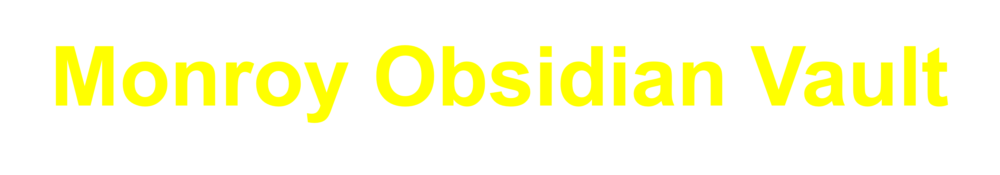

  

# ❓What is Obsidian?
[Obsidian](https://obsidian.md/) is a powerful, free note-taking application with a lot of flexibility and customization options. Also, notes are stored locally!

# 📅 What is the Monroy Obsidian Vault?
Obsidian notes are organized within vaults, which can be thought of as root folders. Each vault can be uniquely customized to suit different workflows and preferences. The Monroy Obsidian Vault is designed with two main objectives: 1) to provide an easy start for those new to Obsidian, and 2) to introduce an effective approach to project management, heavily inspired by the Getting Things Done (GTD) methodology.

This vault is the result of a review of over 900 community plugins. From this search, approximately 40 were selected to ensure a balance of core functionality and a minimalist design. The result is a system that's not only highly functional but also sleek and user-friendly.

# 🔥 Features
## Vault Setup and Customization
- **In-depth Documentation:** Comprehensive reviews of all settings, offering a thorough understanding of Obsidian's capabilities.
- **Customization Guidance:** Step-by-step instructions on tailoring the vault with community plugins to meet individual needs.
- **Plugin Curation:** A handpicked selection of highly effective plugins to enhance the Obsidian experience, complete with detailed insights and practical usage tips.

## Functionally Simple and Adjustable Template
- **Efficiency and Utility:** A design that emphasizes functionality, steering clear of unnecessary complexities for a streamlined experience.
- **Minimalist Aesthetic:** A clean and uncluttered interface that facilitates a focused and productive working environment.

## GTD Integration
- **Seamless GTD Adoption:** Integrate GTD principles effortlessly into your daily workflow for better task and project management.
- **Structured Organization:** A well-organized system for managing tasks, projects, and notes, aligning with GTD methodology.

## Usage
- **Practical Examples:** Ready-to-use templates and examples for managing daily tasks effectively.
- **Strategic Planning:** Tools and strategies for long-term project planning and personal development, ensuring a holistic approach to productivity.

# Installation
- Download and unzip this vault from Github.
- Follow Nicole's [video](https://www.youtube.com/watch?v=OUrOfIqvGS4) for installing Obsidian and opening a vault.

# ✍🏼 Author's Note
Hi, I'm Francisco Monroy, and this vault is a significant part of my transition from pursuing a Ph.D. In preparation for dropping out (in June 2024), I wanted to create a system that supports the complexity of my long-term goals while managing day-to-day tasks.

This project is not just a tool I use personally, but also a means to connect with and support others on similar journeys. I hope this vault provides as much value to you as it has to me.

## Connect with Me
- [Twitter, Instagram, TikTok](https://linktr.ee/francisco.mnroy)
- [YouTube Channel](https://www.youtube.com/@Francisco.Monroy) - Join me on my journey! I've recorded over 90% of the process in creating this system while dropping out of my Ph.D. If you're interested in studying along with those videos or understanding my thought process behind this project, be sure to check out my YouTube channel. If you're curious to see whether my journey of dropping out turns into a s^^^show, stay tuned!!
