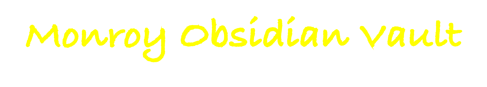

  

# ❓What is Obsidian?
[Obsidian](https://obsidian.md/) is a powerful, free note-taking application with a lot of flexibility and customization options. Also, notes are stored locally!

# 📅 What is the Monroy Obsidian Vault?
Obsidian notes are organized within vaults, which can be thought of as root folders. Each vault can be uniquely customized to suit different workflows and preferences. The Monroy Obsidian Vault is designed with two main objectives: 1) to provide an easy start for those new to Obsidian, and 2) to introduce an effective approach to project management, heavily inspired by the Getting Things Done (GTD) methodology.

This vault is the result of a review of over 900 community plugins. From this search, approximately 40 were selected to ensure a balance of core functionality and a minimalist design. The result is a system that's not only highly functional but also sleek and user-friendly.

# 🔥Features
### Installation and Setup
- Detailed instructions on how to install and configure the vault.
- Guidance on customizing the vault to suit individual needs.
### Usage
- Examples and templates for day-to-day task management.
- Strategies for long-term project planning and personal development.
### GTD Integration
- Seamlessly incorporate GTD principles into your daily workflow.
- Organized structure for managing tasks, projects, and notes.

### Functional Simplicity
- Focus on utility and efficiency, avoiding unnecessary complexities.
- Minimalist design for a clutter-free and focused working environment.

### Community Plugin Insights
- Curated selection of the most effective plugins for enhancing the Obsidian experience.
- Detailed insights and usage tips for each integrated plugin.

### Comprehensive Documentation
- Step-by-step guides for setting up and using the vault.
- Best practices and tips for personal and professional productivity.

# ✍🏼 Author's Note
Hi, I'm Francisco Monroy, and this vault is a significant part of my transition from pursuing a Ph.D. In preparation for dropping out of a structured academic program (in June 2024) has led me to create a system that supports the complexity my day-to-day tasks and long-term goals.

This project is not just a tool I use personally, but also a means to connect with and support others on similar journeys. I hope this vault provides as much value to you as it has to me.

## Connect with Me
- [Twitter, Instagram, TikTok](https://linktr.ee/francisco.mnroy)
- [YouTube Channel](https://www.youtube.com/@Francisco.Monroy)

![[Screenshot 2023-12-31 at 12.33.37 AM.png]]

![[Screenshot 2023-12-31 at 12.34.44 AM.png]]

![[Screenshot 2023-12-31 at 12.35.04 AM.png]]

![[Screenshot 2023-12-31 at 12.35.48 AM.png]]

